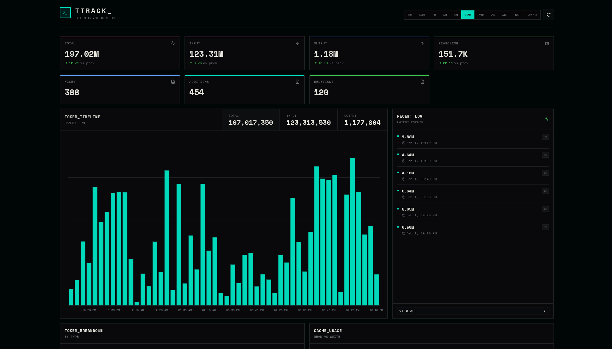

<div align="center">
  <h1>TTrack</h1>
  
  <p><strong>Token Tracker</strong> - A system for monitoring and analyzing AI token usage across your projects</p>
</div>

## What is TTrack?

TTrack helps you understand how much you are spending on AI by tracking token consumption from AI assistant interactions. It captures input, output, reasoning, and cache tokens for each message, then visualizes this data in an easy-to-read dashboard.

## Project Structure

Think of TTrack as having four main parts that work together:

1. **Plugin** - The collector that runs inside OpenCode and captures token data from each AI conversation
2. **Tracker Library** - A small package that handles sending the captured data to the tracking server
3. **Web Dashboard** - A web interface where you can view charts and metrics about your token usage over time
4. **UI Components** - Shared building blocks used across the project for a consistent look and feel

Here is how the code is organized:

```
TTrack/
├── .opencode/
│   └── plugin/          # The OpenCode plugin that captures tokens
├── packages/
│   ├── tracker/         # Library for sending token data
│   ├── ui/              # Shared user interface components
│   └── typescript-config/  # Shared configuration files
└── apps/
    └── web/             # The web dashboard you view in your browser
```

## How It Works

1. The plugin watches for AI responses in OpenCode
2. When a response comes in, it extracts token counts (input, output, reasoning, cache)
3. The tracker library sends this data to the tracking server
4. The web dashboard reads this data and displays it as charts and statistics
5. You can see trends, compare time periods, and understand your usage patterns

## Quick Start

The fastest way to get TTrack running is with Docker Compose:

```bash
# Clone the repository
git clone https://github.com/Fractal-Tess/TTrack.git
cd TTrack

# Start the entire stack
docker compose up -d
```

This will spin up:

- **InfluxDB** on port 8086 (time-series database for token data)
- **TTrack Web Dashboard** on port 3000

Access the dashboard at http://localhost:3000

### Manual Setup

If you prefer to run components separately:

1. Start InfluxDB 2.x with a bucket named `token_usage`
2. Set environment variables:
   - `INFLUXDB_URL` - Your InfluxDB instance URL
   - `INFLUXDB_TOKEN` - Your InfluxDB API token
   - `INFLUXDB_ORG` - Your InfluxDB organization
   - `INFLUXDB_BUCKET` - The bucket name (default: token_usage)
   - `NEXT_PUBLIC_APP_URL` - The public URL of your web dashboard
3. Run the web app: `cd apps/web && bun run dev`
