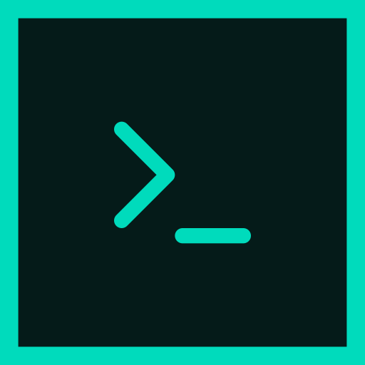
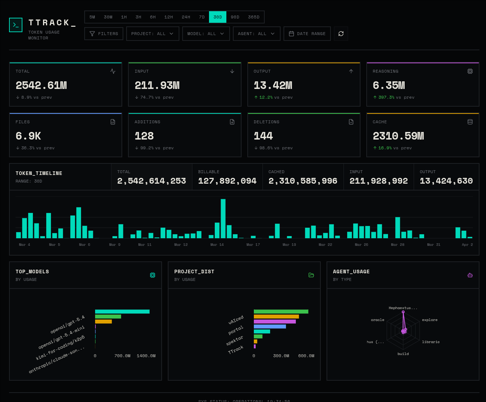

<div align="center">
  
  <h1>TTrack</h1>
  
  <p><strong>Token Tracker</strong> - A system for monitoring and analyzing AI token usage across your projects</p>
</div>

## What is TTrack?

TTrack helps you understand how much you are spending on AI by tracking token consumption from AI assistant interactions. It captures input, output, reasoning, and cache tokens for each message, then visualizes this data in an easy-to-read dashboard.

TTrack currently supports:

- **OpenCode** via an in-process plugin
- **OpenAI Codex CLI** via a local hook-driven tracking CLI

## Project Structure

Think of TTrack as having four main parts that work together:

1. **Collectors** - Integrations that capture token data from supported clients like OpenCode and Codex CLI
2. **Tracker Library** - A small package that handles sending the captured data to the tracking server
3. **Web Dashboard** - A web interface where you can view charts and metrics about your token usage over time
4. **UI Components** - Shared building blocks used across the project for a consistent look and feel

Here is how the code is organized:

```
TTrack/
├── apps/
│   ├── codex-plugin/    # Codex CLI hook-based tracker
│   └── web/             # The web dashboard you view in your browser
├── .opencode/
│   └── plugin/          # The OpenCode plugin that captures tokens
├── packages/
│   ├── tracker/         # Library for sending token data
│   ├── ui/              # Shared user interface components
│   └── typescript-config/  # Shared configuration files
```

## How It Works

1. A supported collector captures token usage from your AI client
2. The collector extracts token counts, cache usage, and file change metadata
3. The tracker library sends this data to InfluxDB
4. The web dashboard reads this data and displays it as charts and statistics
5. You can see trends, compare time periods, and understand your usage patterns

## Quick Start

The fastest way to get TTrack running is with Docker Compose:

```bash
# Clone the repository
git clone https://github.com/Fractal-Tess/TTrack.git
cd TTrack

# Start the entire stack
docker compose up -d
```

This will spin up:

- **InfluxDB** on port 8086 (time-series database for token data)
- **TTrack Web Dashboard** on port 3000

Access the dashboard at http://localhost:3000

### Manual Setup

If you prefer to run components separately:

1. Start InfluxDB 2.x with a bucket named `token_usage`
2. Set environment variables:
   - `INFLUXDB_URL` - Your InfluxDB instance URL
   - `INFLUXDB_TOKEN` - Your InfluxDB API token
   - `INFLUXDB_ORG` - Your InfluxDB organization
   - `INFLUXDB_BUCKET` - The bucket name (default: token_usage)
   - `NEXT_PUBLIC_APP_URL` - The public URL of your web dashboard
3. Run the web app: `cd apps/web && bun run dev`

## Supported Clients

### OpenCode

OpenCode is supported through the existing plugin integration in this repository.

### Codex CLI

Codex is supported through `apps/codex-plugin`, a local CLI that hooks into Codex's `notify` event and parses Codex session JSONL files after each completed turn.

After setup, you use `codex` normally and TTrack syncs completed turns automatically.

## Codex Setup

1. Build the Codex tracker:

```bash
bun run --cwd apps/codex-plugin build
```

2. Install the `codex-ttrack` command.

If you want a simple local install, create a wrapper in your shell path that runs:

```bash
node /absolute/path/to/TTrack/apps/codex-plugin/dist/cli.js "$@"
```

3. Configure InfluxDB credentials:

```bash
codex-ttrack configure
```

4. Install the Codex hook:

```bash
codex-ttrack setup
```

This writes the following to `~/.codex/config.toml`:

```toml
notify = ["codex-ttrack", "hook", "agent-turn-complete"]
```

5. Verify the setup:

```bash
codex-ttrack verify
```

6. Use Codex normally:

```bash
codex
```

After each completed turn, `codex-ttrack` will:

- read the latest Codex session file from `~/.codex/sessions`
- extract per-turn token usage
- capture `apply_patch` file change counts
- send the turn to InfluxDB
- dedupe by `turn_id` to avoid double counting
